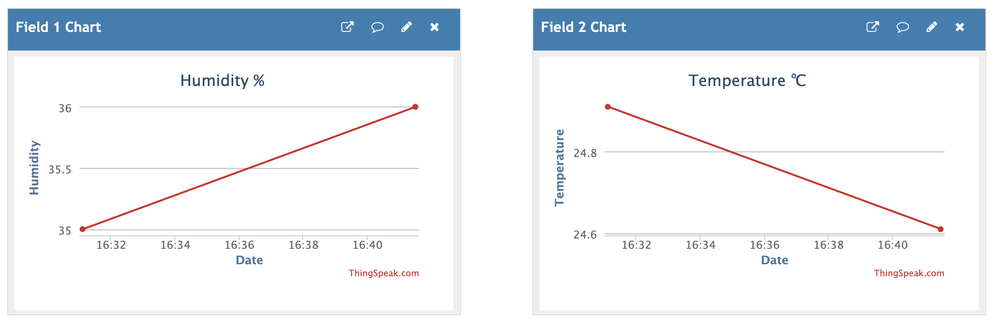

# Temperature and humidity measurer

Project for the course Introduction to Applied IoT, Summer 2023

**Name:** Shota Napetvaridze <br>
**Student:** sn223ki

# Short project overview
In this project I built a sensor node with an ESP8266 that publishes the temperature and humidity once a day to a free service called Thing Speak which allows users to communicate with internet enabled devices.

**Approxiamtion of time needed for the project:**

Around one hour to two hours


# Objective
**Reasons for choosing the project:**
The reason I choose this project is that I have a plant at home and I decided to create the perfect environment for it.

**Purposes of the project:**
The main objective of this project is twofold. Firstly, it aims to provide a learning experience about the Internet of Things (IoT), including understanding how to construct an IoT device and connect it to a platform for visualizing its data. Secondly, it aims to create an ideal environment for nurturing and taking care of a plant.

**Insights gained by doing the project:**
The project offers an opportunity to gain an understanding of fundamental concepts in IoT, programming language (C++), and electrical circuits. It provides insights into these areas of knowledge.

# Material
Component | Purpose    
-| -| 
ESP8266 | A microcontroller used for data collection, data transfer, and data analysis. 
DHT11 | A sensor used for mesuring the humidity in the air asweel as the temperature 
40x jumper wires Male/Female | 	Wires for connecting the different components
4.7k Ohm resistor | prevents it from floating when the sensor is not actively transmitting data 
Breadboard 800 points | A board used to easy connect the sensors without soldering 
Micro USB cable | Connection between a microcontroller and computer

The Items above were already in possession.


Figure 1: Components used for the project

All components are shown in Figure 1. From left to right:
* Breadboard
* ESP8266
* 4.7k Ohm resistor
* Jumper wires
* DHT11
* Micro USB cable


# Computer setup
**Setting up the IDE:**


The first step is setting up IDE.In my case, I installed Arduino IDE (https://www.arduino.cc/en/software). After installation we have to install two Arduino libraries: 


Note: you may also need to install the Adafruit Sensor library.


In this project, I used the website https://ThingSpeak.com. By using ThingSpeak, you can share your sensor data on their platform and visualize it on a graph along with timestamps. This enables you to conveniently access your sensor readings from any location worldwide.

The next step is to update the firmware of the ESP32. This is done by donwloading this file https://micropython.org/resources/firmware/esp32-20220117-v1.18.bin to your computer and on this website https://nabucasa.github.io/esp-web-flasher/ connect your development board by choosing 460800 Baud in the top right corner and pressing connect. You then press erase to delete the files on the board so that you then can enter aoffset of 100 and in "choose file" select the downloaded file and then press "Program".(It takes a while and during this time don’t disconnect your board from the USB cable)

The next thing to do is to download and install Node js (Windows download link https://nodejs.org/en/) and choose a IDE for the project and i choose work in Atom.io (Windows download link https://atom.io/). Then add the Pymakr plugin to Atom by going to File >> Settings >> Install and Look for Pymakr and Install it. (It takes a while; wait until shows it is successfully installed)

You are now ready to run your code on the development board. In order to uppload the code you need to open the Pymakr plugin that you find at the bottom and go into its setting and choose global settings. Enter the device com port into the Device address (list) field (which can be found in the device manager) and remove the check box selection from Safe-boot before upload. Go back and press Connect device in Pymakr and choose your COM port to connect to your board. Now you just need to press Upload project to device in order to run your code on the board.

# Putting everything together
The setup of the device and the wiring is shown in a circuit diagram in Figure 3.


Figure 3: Wiring of the components

The EPS8266 is put on in right side of the breadboard. It is powerd by a micro USB cable either connected to a power supply or to a computer. The Vin pin is connected to the breadboards power supply line to give power to the senors and the GND pin is conneced to the GND line. 

Both sensors have a GND pin that is also connected to the breadboards GND line VCC that is connected to the breadboards power supply line. Then each have one data transfer pin, since the capacitive soil moisture sensor is a analog senor then the data pin is wired to a ADC (Analogue to Digital Converter)  pin in this case GPIO36 and DHT11 is connected to GPIO14.

# Chosen platform

The platform I selected for this project is ThingSpeak since it is a free cloud service that aligns well with the requirements of my project. ThingSpeak provides convenient features for visualizing data in real-time on their online dashboard, allowing users to choose various display formats such as diagrams or gauges. Additionally, it offers the capability to analyze the data online through the channels, providing simple and accessible ways to perform data analysis.


Figure 3: The dashboard page on Thingspeak

# The code
The first code part shown in figure 4 has first the necessary libaries that is needed for the project such as machine that is used for connecting to the microcontroller, dht that is used for getting the DHT11 sensor to work, network for connecting the device to wifi and mqtt for sending data over the internet.
```
/*
 * ESP8266 Daily Task
 * Shota Napetvaridze
 * Complete Project Details https://github.com/Wiz1101/My_IoT_Project
 */

#include <ESP8266WiFi.h>
#include <ESPDailyTask.h>
#include "DHT.h"

// DHT sensor
#define DHTTYPE DHT11  // DHT 11

// Replace with your SSID and Password
const char* ssid = "";
const char* password = "";

// Replace with your unique Thing Speak WRITE API KEY
const char* apiKey = "";

const char* resource = "/update?api_key=";

// Thing Speak API server
const char* server = "api.thingspeak.com";

// Set this for what time your daily code should run
ESPDailyTask dailyTask(11 * 60 + 15);  // 11:15am

// DHT Sensor
const int DHTPin = 5;
// Initialize DHT sensor.
DHT dht(DHTPin, DHTTYPE);

// Temporary variables
static char temperatureTemp[7];
static char humidityTemp[7];

void setup() {
  // Initializing serial port for debugging purposes
  Serial.begin(115200);
  delay(10);

  dailyTask.sleep1Day();

  // put your daily code here...
  dht.begin();

  initWifi();
  makeHTTPRequest();

  // and back to sleep once daily code is done
  dailyTask.backToSleep();
}

void loop() {
  // sleeping so wont get here
}

// Establish a Wi-Fi connection with your router
void initWifi() {
  Serial.print("Connecting to: ");
  Serial.print(ssid);
  WiFi.begin(ssid, password);

  int timeout = 10 * 4;  // 10 seconds
  while (WiFi.status() != WL_CONNECTED && (timeout-- > 0)) {
    delay(250);
    Serial.print(".");
  }
  Serial.println("");

  if (WiFi.status() != WL_CONNECTED) {
    Serial.println("Failed to connect, going back to sleep");
  } else {
    Serial.print("WiFi connected in: ");
    Serial.print(millis());
    Serial.print(", IP address: ");
    Serial.println(WiFi.localIP());
  }
}

// Make an HTTP request to Thing Speak
void makeHTTPRequest() {
  // Sensor readings may also be up to 2 seconds 'old' (its a very slow sensor)
  float h = dht.readHumidity();
  // Read temperature as Celsius (the default)
  float t = dht.readTemperature();
  // Read temperature as Fahrenheit (isFahrenheit = true)
  float f = dht.readTemperature(true);
  // Check if any reads failed and exit early (to try again).
  if (isnan(h) || isnan(t) || isnan(f)) {
    Serial.println("Failed to read from DHT sensor!");
    strcpy(temperatureTemp, "Failed");
    strcpy(humidityTemp, "Failed");
    return;
  } else {
    // Computes temperature values in Celsius + Fahrenheit and Humidity
    float hic = dht.computeHeatIndex(t, h, false);
    // Comment the next line, if you prefer to use Fahrenheit
    dtostrf(hic, 6, 2, temperatureTemp);

    float hif = dht.computeHeatIndex(f, h);
    // Uncomment the next line, if you want to use Fahrenheit
    //dtostrf(hif, 6, 2, temperatureTemp);

    dtostrf(h, 6, 2, humidityTemp);
    // You can delete the following Serial.print's, it's just for debugging purposes
    Serial.print("Humidity: ");
    Serial.print(h);
    Serial.print(" %\t Temperature: ");
    Serial.print(t);
    Serial.print(" *C ");
    Serial.print(f);
    Serial.print(" *F\t Heat index: ");
    Serial.print(hic);
    Serial.print(" *C ");
    Serial.print(hif);
    Serial.print(" *F");
    Serial.print("Humidity: ");
    Serial.print(h);
    Serial.print(" %\t Temperature: ");
    Serial.print(t);
    Serial.print(" *C ");
    Serial.print(f);
    Serial.print(" *F\t Heat index: ");
    Serial.print(hic);
    Serial.print(" *C ");
    Serial.print(hif);
    Serial.println(" *F");
  }

  Serial.print("Connecting to ");
  Serial.print(server);

  WiFiClient client;
  int retries = 5;
  while (!client.connect(server, 80) && (retries-- > 0)) {
    Serial.print(".");
  }
  Serial.println();
  if (!client.connected()) {
    Serial.println("Failed to connect, going back to sleep");
  }

  Serial.print("Request resource: ");
  Serial.print(resource);


  String payload = String(apiKey) + "&field1=" + String(humidityTemp) + "&field2=" + String(temperatureTemp);
  String httpRequest = "POST " + String(resource) + apiKey + " HTTP/1.1\r\n";
  httpRequest += "Host: " + String(server) + "\r\n";
  httpRequest += "Connection: close\r\n";
  httpRequest += "Content-Type: application/x-www-form-urlencoded\r\n";
  httpRequest += "Content-Length: " + String(payload.length()) + "\r\n\r\n";
  httpRequest += payload;

  client.print(httpRequest);

  int timeout = 5 * 10;  // 5 seconds
  while (!client.available() && (timeout-- > 0)) {
    delay(100);
  }
  if (!client.available()) {
    Serial.println("No response, going back to sleep");
  }
  while (client.available()) {
    Serial.write(client.read());
  }

  Serial.println("\nclosing connection");
  client.stop();
}

```
Result 
```
WiFi connected in: 4552, IP address: 192.168.1.4
Humidity: 36.00 %	 Temperature: 25.10 *C 77.18 *F	 Heat index: 24.61 *C 76.29 *FHumidity: 36.00 %	 Tmperature: 25.10 *C 77.18 *F	 Heat index: 24.61 *C 76.29 *F
Connecting to api.thingspeak.com
Request resource: /update?api_key=HTTP/1.1 200 OK
Date: Fri, 30 Jun 2023 14:41:31 GMT
Content-Type: text/plain; charset=utf-8
Content-Length: 1
Connection: close
Status: 200 OK
Cache-Control: max-age=0, private, must-revalidate
Access-Control-Allow-Origin: *
Access-Control-Max-Age: 1800
X-Request-Id: af4fd6d3-91ed-4e13-934c-54b3368c784e

```

Then there is variables that are used later in the code, configuration for network and adrafruit and then Setup of the sensors

Figure 4: First code snippet

This is the main function of the code that tries to  measures data from the sensors, prints the values and then tries to send that data to adafruit and throws exceptions if anything goes wrong.

Figure 5: Second code snippet

First we have the function restart_and_reconnect that restart the microcontroller and gets called if a exception gets called in the code that would make the code crash. Then do_connect is a function that connects the device to wife.

The code under that tries to set up a connection between the device and adafruit by using MQTT and calls restart_and_reconnect if something goes wrong. Then lastly we have the infinite loop that calls send_sensor_data() until a exception gets thrown and in that case calls restart_and_reconnect.


Figure 6: Third code snippet

# Transmitting the data / connectivity

I chose to send data at a 24-hour interval because the main objective of this project is to monitor the plant's environment. Hence, I deemed a 24-hour gap to be sufficient for this purpose.

Wifi was the wireless protocols used for this project because the micocontroller setup is in my home close to my router and do not need any protocol with longer range because of that. Wifi also has no recurring costs, low latency and less bandwidth restrictions so it seemed like to best options.

As for the transport protocols MQTT and webhooks is used in this project. MQTT is used for sending the data measured by the sensors to adafruit. It was choosen because it is a lightweight, energy-efficient and easy to use Transport protocol. Webhooks is also used for when the moisture level in the soil reaches under 30 percent to send a message to my discord that it is time to water my plant.

# Presenting the data
The dashboard on adafruit is set up by 3 feeds of data one for air moisture, one for soil moisture and one for temperature. Each of these 3 feed have 1 diagram showing how the value of each sensor has changed over the past 7 days. For the two moisture feeds a gauge was chosen to display att what percentage of moisture the sensors was at the last reading and for the temperature a text field shows what temeprature it was at the last reading.

Figure 7: The dashboard page on Adafruit

You can also go in to each feed where you can see a more detaild diagram over the data and get each value in a table where you can see the exact value and at what time it was sent.


Figure 8: The air moisture feed page on Adafruit

# Finalizing the design
After assembling the project this is result.

Figure 8: Finalized project


Figure 9: Finalized project

**Final Thoughts**

I would describe the results of the project as fulfilling because I successfully achieved my initial goals. With my previous programming experience, I found the coding aspect of the project relatively manageable, except for some difficulties encountered when presenting data on Thingspeak.com specifically The error I was getting due to an issue with the construction of the HTTP request. .

