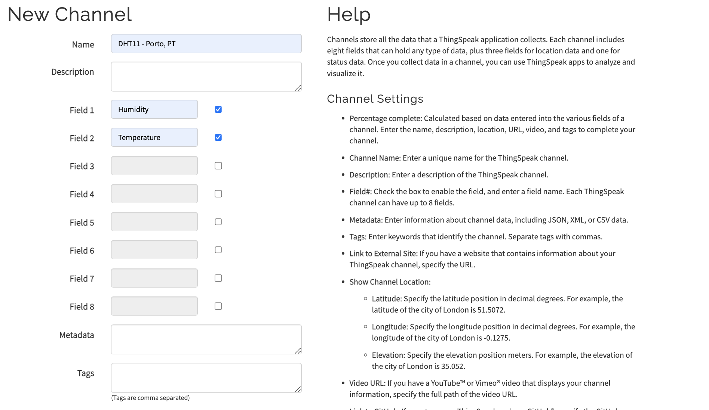

# Temperature and humidity measurer

Project for the course Introduction to Applied IoT, Summer 2023

**Name:** Shota Napetvaridze <br>
**Student:** sn223ki

# Short project overview
In this project I built a sensor node with an ESP8266 that publishes the temperature and humidity once a day to a free service called Thing Speak which allows users to communicate with internet enabled devices.

**Approxiamtion of time needed for the project:**

Around one hour to two hours


# Objective
**Reasons for choosing the project:**
The reason I choose this project is that I have a plant at home and I decided to create the perfect environment for it.

**Purposes of the project:**
The main objective of this project is twofold. Firstly, it aims to provide a learning experience about the Internet of Things (IoT), including understanding how to construct an IoT device and connect it to a platform for visualizing its data. Secondly, it aims to create an ideal environment for nurturing and taking care of a plant.

**Insights gained by doing the project:**
The project offers an opportunity to gain an understanding of fundamental concepts in IoT, programming language (C++), and electrical circuits. It provides insights into these areas of knowledge.

# Material
Component | Purpose    
-| -| 
ESP8266 | A microcontroller used for data collection, data transfer, and data analysis. 
DHT11 | A sensor used for mesuring the humidity in the air asweel as the temperature 
40x jumper wires Male/Female | 	Wires for connecting the different components
4.7k Ohm resistor | prevents it from floating when the sensor is not actively transmitting data 
Breadboard 800 points | A board used to easy connect the sensors without soldering 
Micro USB cable | Connection between ESP8266 and a computer

The Items above were already in possession.


Figure 1: Components used for the project

All components are shown in Figure 1. From left to right:
* Breadboard
* ESP8266
* 4.7k Ohm resistor
* Jumper wires
* DHT11
* Micro USB cable


# Computer setup
**Setting up the IDE:**


The first step is setting up IDE.In my case, I installed Arduino IDE (https://www.arduino.cc/en/software). After installation we have to install two Arduino libraries: 


Note: you may also need to install Adafruit Sensor and Aduinojson libraries.


In this project, I used the website https://ThingSpeak.com. By using ThingSpeak, you can share your sensor data on their platform and visualize it on a graph along with timestamps. This enables you to conveniently access your sensor readings from any location worldwide.

The next step is to set environment for ESP8266 in Arduino IDE. In my case I chose NodeMCU 0.9 (ESP-12 Module) from ESP8266 boards 


Figure 3: Configuring enviroment in Arduino IDE for ESP8266

Next step is creating a new channel on Thingspeak and getting and API key for uploading the data.


You are now ready to run your code on the development board. To upload the code, follow these steps:

1. Open the Arduino IDE.
2. Replace the placeholders in the code with your actual SSID, Wi-Fi password, and API key.
3. Make sure you have assembled the circuit according to the circuit diagram.
4. Connect the development board to your computer.
5. Select the appropriate board and port in the Arduino IDE.
6. Click on the 'Upload' button to compile and upload the code to the ESP8266.

Once the code is successfully uploaded, the ESP8266 will be ready to run and send data to the specified ThingSpeak channel.

# Putting everything together
The setup of the device and the wiring is shown in a circuit diagram in Figure 3.


Figure 4: Wiring of the components

The EPS8266 is put on in right side of the breadboard. It is powerd by a micro USB cable either connected to a power supply or to a computer. The Vin pin is connected to the breadboards power supply line to give power to the senors and the GND pin is conneced to the GND line. 

Both sensors have a GND pin that is also connected to the breadboards GND line VCC that is connected to the breadboards power supply line. Then each have one data transfer pin, since the capacitive soil moisture sensor is a analog senor then the data pin is wired to a ADC (Analogue to Digital Converter)  pin in this case GPIO36 and DHT11 is connected to GPIO14.

# Chosen platform

The platform I selected for this project is ThingSpeak since it is a free cloud service that aligns well with the requirements of my project. ThingSpeak provides convenient features for visualizing data in real-time on their online dashboard, allowing users to choose various display formats such as diagrams or gauges. Additionally, it offers the capability to analyze the data online through the channels, providing simple and accessible ways to perform data analysis.


Figure 3: The dashboard page on Thingspeak

# The code
The code sets up the ESP8266 to run a daily task at a specific time (11:15 AM) where it reads data from a DHT sensor (humidity and temperature), establishes a Wi-Fi connection, and sends the data to the ThingSpeak server using an HTTP POST request. The microcontroller then goes back to deep sleep and repeats the process the next day. 


<mark>Code snippet 1: Source code</mark>
```
/*
 * ESP8266 Daily Task
 * Shota Napetvaridze
 * Complete Project Details https://github.com/Wiz1101/My_IoT_Project
 */

#include <ESP8266WiFi.h>
#include <ESPDailyTask.h>
#include "DHT.h"

// DHT sensor
#define DHTTYPE DHT11  // DHT 11

// Replace with your SSID and Password
const char* ssid = ""; // Your Wifi SSID goes here 
const char* password = ""; // Your Wifi password goes here 

// Replace with your unique Thing Speak WRITE API KEY
const char* apiKey = ""; Your Thingspeak API key goes here 

const char* resource = "/update?api_key=";

// Thing Speak API server
const char* server = "api.thingspeak.com";

// Set this for what time your daily code should run
ESPDailyTask dailyTask(11 * 60 + 15);  // 11:15am

// DHT Sensor
const int DHTPin = 5;
// Initialize DHT sensor.
DHT dht(DHTPin, DHTTYPE);

// Temporary variables
static char temperatureTemp[7];
static char humidityTemp[7];

void setup() {
  // Initializing serial port for debugging purposes
  Serial.begin(115200);
  delay(10);

  dailyTask.sleep1Day();

  // put your daily code here...
  dht.begin();

  initWifi();
  makeHTTPRequest();

  // and back to sleep once daily code is done
  dailyTask.backToSleep();
}

void loop() {
  // sleeping so wont get here
}

// Establish a Wi-Fi connection with your router
void initWifi() {
  Serial.print("Connecting to: ");
  Serial.print(ssid);
  WiFi.begin(ssid, password);

  int timeout = 10 * 4;  // 10 seconds
  while (WiFi.status() != WL_CONNECTED && (timeout-- > 0)) {
    delay(250);
    Serial.print(".");
  }
  Serial.println("");

  if (WiFi.status() != WL_CONNECTED) {
    Serial.println("Failed to connect, going back to sleep");
  } else {
    Serial.print("WiFi connected in: ");
    Serial.print(millis());
    Serial.print(", IP address: ");
    Serial.println(WiFi.localIP());
  }
}

// Make an HTTP request to Thing Speak
void makeHTTPRequest() {
  // Sensor readings may also be up to 2 seconds 'old' (its a very slow sensor)
  float h = dht.readHumidity();
  // Read temperature as Celsius (the default)
  float t = dht.readTemperature();
  // Read temperature as Fahrenheit (isFahrenheit = true)
  float f = dht.readTemperature(true);
  // Check if any reads failed and exit early (to try again).
  if (isnan(h) || isnan(t) || isnan(f)) {
    Serial.println("Failed to read from DHT sensor!");
    strcpy(temperatureTemp, "Failed");
    strcpy(humidityTemp, "Failed");
    return;
  } else {
    // Computes temperature values in Celsius + Fahrenheit and Humidity
    float hic = dht.computeHeatIndex(t, h, false);
    // Comment the next line, if you prefer to use Fahrenheit
    dtostrf(hic, 6, 2, temperatureTemp);

    float hif = dht.computeHeatIndex(f, h);
    // Uncomment the next line, if you want to use Fahrenheit
    //dtostrf(hif, 6, 2, temperatureTemp);

    dtostrf(h, 6, 2, humidityTemp);
    // You can delete the following Serial.print's, it's just for debugging purposes
    Serial.print("Humidity: ");
    Serial.print(h);
    Serial.print(" %\t Temperature: ");
    Serial.print(t);
    Serial.print(" *C ");
    Serial.print(f);
    Serial.print(" *F\t Heat index: ");
    Serial.print(hic);
    Serial.print(" *C ");
    Serial.print(hif);
    Serial.print(" *F");
    Serial.print("Humidity: ");
    Serial.print(h);
    Serial.print(" %\t Temperature: ");
    Serial.print(t);
    Serial.print(" *C ");
    Serial.print(f);
    Serial.print(" *F\t Heat index: ");
    Serial.print(hic);
    Serial.print(" *C ");
    Serial.print(hif);
    Serial.println(" *F");
  }

  Serial.print("Connecting to ");
  Serial.print(server);

  WiFiClient client;
  int retries = 5;
  while (!client.connect(server, 80) && (retries-- > 0)) {
    Serial.print(".");
  }
  Serial.println();
  if (!client.connected()) {
    Serial.println("Failed to connect, going back to sleep");
  }

  Serial.print("Request resource: ");
  Serial.print(resource);


  String payload = String(apiKey) + "&field1=" + String(humidityTemp) + "&field2=" + String(temperatureTemp);
  String httpRequest = "POST " + String(resource) + apiKey + " HTTP/1.1\r\n";
  httpRequest += "Host: " + String(server) + "\r\n";
  httpRequest += "Connection: close\r\n";
  httpRequest += "Content-Type: application/x-www-form-urlencoded\r\n";
  httpRequest += "Content-Length: " + String(payload.length()) + "\r\n\r\n";
  httpRequest += payload;

  client.print(httpRequest);

  int timeout = 5 * 10;  // 5 seconds
  while (!client.available() && (timeout-- > 0)) {
    delay(100);
  }
  if (!client.available()) {
    Serial.println("No response, going back to sleep");
  }
  while (client.available()) {
    Serial.write(client.read());
  }

  Serial.println("\nclosing connection");
  client.stop();
}

```
The program begins by including the required libraries for the project. The code utilizes the ESP8266WiFi library to manage Wi-Fi connections, the ESPDailyTask library for scheduling daily tasks on the ESP8266, and the DHT library to interact with the DHT temperature and humidity sensor.Let's go through each function in the code and explain what it does: 

1. setup(): function runs once when the microcontroller (ESP8266) starts. It is used for initializing and configuring various components and libraries before entering the main loop. In this code, it performs the following actions:
    * Initializes the serial communication for debugging purposes (using the Serial.begin() function).
    * Sets a delay of 10 milliseconds (using delay(10)) to allow the serial communication to stabilize.
    * Calls dailyTask.sleep1Day(), which will put the microcontroller into deep sleep for approximately 24 hours. The purpose is to make the code run daily at a specific time, which is set in the dailyTask object.
    * Initializes the DHT (humidity and temperature) sensor with the dht.begin() function. Calls the initWifi() function to establish a Wi-Fi connection.
    * Calls the makeHTTPRequest() function to send data to the ThingSpeak server.
    * After completing the above tasks, it calls dailyTask.backToSleep() to put the microcontroller back to sleep for another 24 hours.

2. loop(): This loop function runs repeatedly after the setup() function is executed. In this code, the loop() function is empty because the main task is performed in the setup() function. The loop is intentionally kept empty to save power since the microcontroller goes to deep sleep and wakes up again after 24 hours.

3. initWifi(): This function is responsible for establishing a Wi-Fi connection with the specified router. It uses the WiFi.begin() function to connect to the Wi-Fi network and waits for the connection to be established within a timeout period. If the connection is successful, it prints the Wi-Fi connection details (local IP address) to the serial monitor.

4. makeHTTPRequest(): This function is used to make an HTTP POST request to the ThingSpeak server to send sensor data. Here's how it works:
    * Reads the temperature and humidity data from the DHT sensor using dht.readHumidity() and dht.readTemperature() functions, respectively.
    * Checks if any of the readings are invalid (NaN), indicating a failed sensor reading. If any of the readings are invalid, it sets the temperatureTemp and humidityTemp variables to "Failed" and returns without making the HTTP request.
    * If the sensor readings are valid, it computes the heat index for both Celsius and Fahrenheit (if applicable) using the dht.computeHeatIndex() function.
    * Converts the sensor readings and heat index values to strings using dtostrf() and stores them in the temperatureTemp and humidityTemp variables.
    * Creates an HTTP request payload with the API key and sensor data in the format required by ThingSpeak.
    * Establishes a connection to the ThingSpeak server using a WiFiClient object and the client.connect() function.
    * Constructs an HTTP POST request with the payload and sends it to the server using the client.print() function.
    * Waits for a response from the server within a timeout period. If no response is received, it prints "No response, going back to sleep" to the serial monitor and returns.
    * If a response is received, it prints the response data to the serial monitor and closes the connection with the server using client.stop().


<mark>Code snippet 2: Terminal output of establishing a Wi-Fi connection, and sending the data to the ThingSpeak server using an HTTP POST request.</mark>

```
WiFi connected in: 4552, IP address: 192.168.1.4
Humidity: 36.00 %	 Temperature: 25.10 *C 77.18 *F	 Heat index: 24.61 *C 76.29 *FHumidity: 36.00 %	 Tmperature: 25.10 *C 77.18 *F	 Heat index: 24.61 *C 76.29 *F
Connecting to api.thingspeak.com
Request resource: /update?api_key=HTTP/1.1 200 OK
Date: Fri, 30 Jun 2023 14:41:31 GMT
Content-Type: text/plain; charset=utf-8
Content-Length: 1
Connection: close
Status: 200 OK
Cache-Control: max-age=0, private, must-revalidate
Access-Control-Allow-Origin: *
Access-Control-Max-Age: 1800
X-Request-Id: af4fd6d3-91ed-4e13-934c-54b3368c784e

```


# Transmitting the data / connectivity


I chose to send data at a 24-hour interval because the main objective of this project is to monitor the plant's environment. Hence, I deemed a 24-hour gap to be sufficient for this purpose.

Wifi was the wireless protocols used for this project because the micocontroller setup is in my home close to my router and do not need any protocol with longer range because of that. Wifi also has no recurring costs, low latency and less bandwidth restrictions so it seemed like to best options.

akjslkasbf;kasbf;kasf;kash;fhas;fhasfhj;kashf;


As for the transport protocols MQTT and webhooks is used in this project. MQTT is used for sending the data measured by the sensors to adafruit. It was choosen because it is a lightweight, energy-efficient and easy to use Transport protocol. Webhooks is also used for when the moisture level in the soil reaches under 30 percent to send a message to my discord that it is time to water my plant.

# Presenting the data
The Thingspeak dashboard is configured with two data fields: one for humidity and one for temperature. Each field is accompanied by a diagram that displays the respective sensor values over the last 24 hours. The humidity data is presented in percentages, while the temperature data is shown in Celsius.


Figure 7: Humidity field on Thingspeak


Figure 8: Temperature field on Thingspeak

By hovering over a diagram, you can view the precise value and the corresponding timestamp of the data point.

# Finalizing the design
After assembling the project this is result.

Figure 8: Finalized project


Figure 9: Finalized project

**Final Thoughts**

I would describe the results of the project as fulfilling because I successfully achieved my initial goals. With my previous programming experience, I found the coding aspect of the project relatively manageable, except for some difficulties encountered when presenting data on Thingspeak.com specifically The error I was getting due to an issue with the construction of the HTTP request. .

